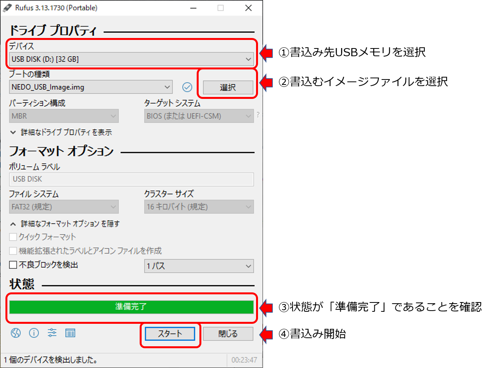
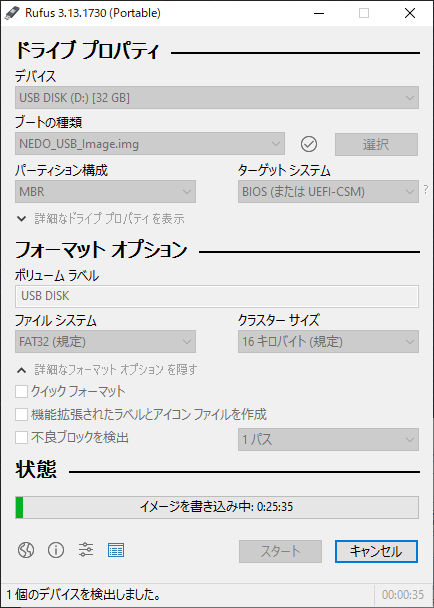
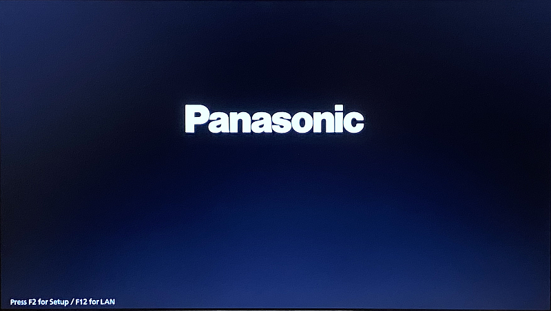
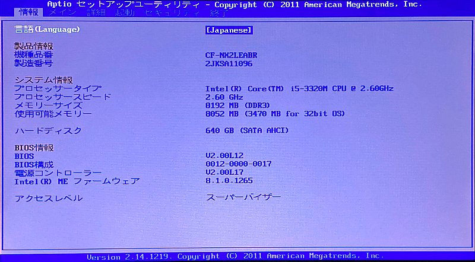
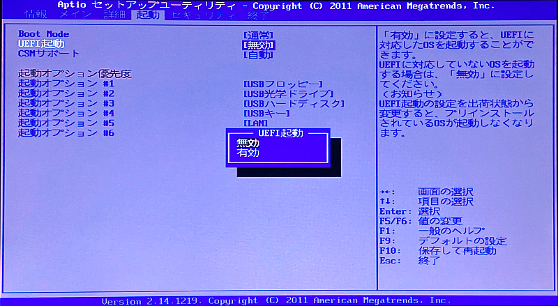
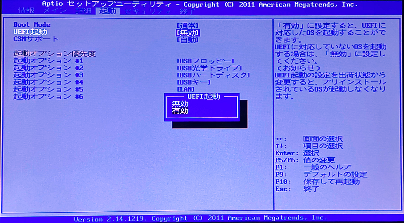
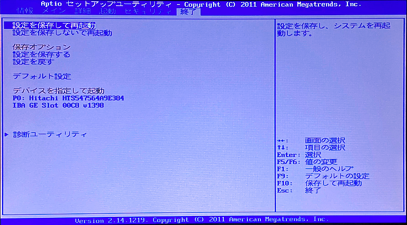
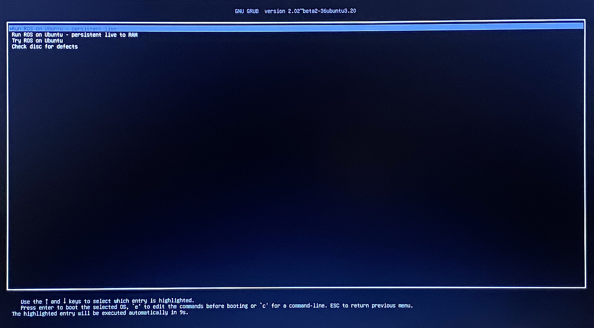
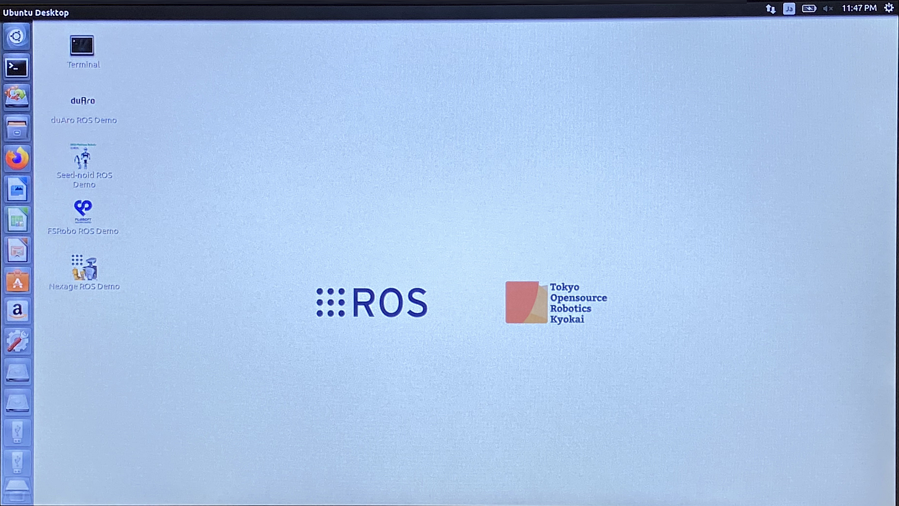

# 起動可能なUSBメモリ作成方法

NEDO講座等の講習会で配布する起動可能なUSBメモリは、自分で作成することができます。
ここでは、当サイトからイメージファイルをダウンロードし、起動可能なUSBメモリを作成する方法を解説します。

## 概要

起動可能なUSBメモリの作成手順は以下のとおりです。

- USBメモリを準備する
- USBに書き込むイメージファイルをダウンロードする
- イメージ書き込みツールをダウンロードする
- USBメモリにイメージファイルを書き込む
- 起動準備
- 起動確認

# 作成手順

## USBメモリを準備する

まず、空のUSBメモリを用意します。
USBメモリのサイズは32GB以上のものをご用意ください。（当サイトで配布しているUSBメモリは32GB構成で作成されているため）

## イメージファイルのダウンロード

まずはじめに、USBメモリに書き込むイメージファイルをダウンロードします。
イメージファイルはUSBメモリを同じサイズ、つまり32GB程度あるため、
ダウンロードするには相応の時間がかかります。
また、イメージファイルは圧縮されているため、ダウンロードして展開するためには
最低64GB程度のハードディスクの空き容量が必要になります。

## イメージ書き込みツールのダウンロード

### Windows の場合

Windowsにおいては、起動可能なUSBイメージを書込み可能な様々なツールがありますが、ここでは
Rufus (ルーファス) を例に取り説明します。Rufusは以下のページからダウンロードできます。

- Rufus Webページ: [https://rufus.ie/](https://rufus.ie/)
  - Rufus 3.13: [rufus-3.13.exe](https://github.com/pbatard/rufus/releases/download/v3.13/rufus-3.13.exe)

Rufusはインストールの必要はありません。そのまま起動可能です。
起動すると以下のような画面が現れますので、

1. USBメモリを選択
2. 書き込むイメージファイル "NEDO_USB_Image.img" を選択
3. 状態を確認：「準備完了」ならOK
4. スタートボタンを押して書き込み開始

書き込みを開始すると、以下の用にプログレスバーに書き込み完了までの時間が表示され、書き込み作業が進行します。
だいたい、20～30分程度かかるでしょう。気長に待ってください。

## 起動準備

次にUSBメモリで起動させるPCの設定を行います。

### BIOS設定画面の起動

まず、PCの電源を一旦切り、USBメモリをPCに挿入してからPCを再起動してみてください。
運よく、Linuxの起動画面が表示されたら、そのPCはUSBメモリからも起動するように設定さています。

もし、PCを再起動してもいつも通りに起動するようであれば、BIOSの設定からUSBからも起動するように設定する必要があります。
BIOS設定はPCによって様々ですが、以下では Panasonic Let's Note を例にとって説明します。

まず、電源投入直後に現れる画面で、以下のように **"Press F2 for Setup"** のようなメッセージが出ていないか確認します。
Let's Note では **"F2"** キーでBIOSセットアップ画面に入ることができます。

以下のような画面が現れたら、起動またはBootと表示されているメニューがないか探してください。
この例では、**起動** メニューが上部に確認できます。

横矢印 **→** キーで **起動**メニューに移動します。
画面に**UEFI**や**UEFI起動** といった項目がない確認してください。

USBメモリから起動するにはUEFIによる起動を有効にする必要があります。
以下の場面例では、無効になっていたUEFI起動を有効にしているところです。
このほかに、起動するデバイスの順序を設定するメニューもあると思います。
そこで、普段起動しているハードディスクよりも、USBメモリまたは
UEFIデバイスからの起動の優先度を上げてあげる必要があるかもしれません。

設定が終わったら終了メニューに移動します。
たいてい、設定を保存時して再起動するメニューがあるので、それを選択し再起動します。
再起動する前に、USBメモリを挿入しておいてください。

USBメモリから起動すると、以下のようなUbuntu Linuxの GRUBの起動画面が表示されます。
メニューにはいくつか種類がありますが、Persistent と書かれている起動メニューは、
起動後のOS上で行った作業をUSBに保存することができるモードですので、
通常、講習会で利用する際にはこのモードを利用してください。

起動すると、以下のようなROSとTorkのロゴのデスクトップ壁紙と、デスクトップ上にKHI duAroや
THKのSeedNoid、富士ソフトのFSRoboおよびNEXTAGEのアイコンがデスクトップ上に確認できます。
この画面が出たら、起動可能なUSBメモリの作成は成功です。お疲れさまでした。

以上が、起動可能なUSBメモリの作成方法でした。

