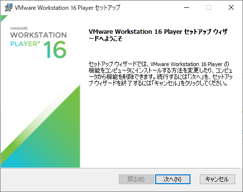
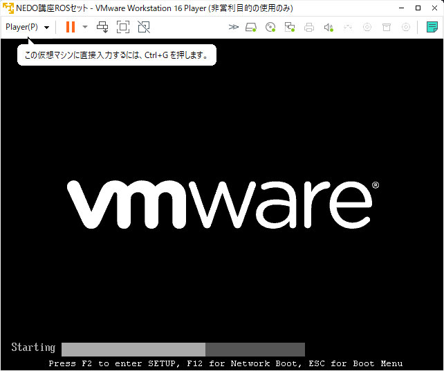

# VMware による NEDO ROSセットの起動

NEDO特別講座で提供している起動可能なROS入りUbuntu LinuxのISOイメージ
(NEDO ROSセットと呼びます) は、DVD-Rなどに書き込んでLive DVD (HDDに
インストールせずに利用する形態のDVD)として利用するものですが、仮想マ
シンを利用することで、WindowsやMac上でUbuntu Linuxを起動することがで
きます。講習会では、TV会議システムを利用しますので、TV会議システムは
Windows上で動作させたまま、仮想マシン上でROS入りUbuntu Linuxを動作さ
せることをお勧めします。

<!-- TOC -->

- [VMware による NEDO ROSセットの起動](#vmware-による-nedo-rosセットの起動)
    - [VMware Workstation Player](#vmware-workstation-player)
        - [VMware Workstation Player のダウンロード](#vmware-workstation-player-のダウンロード)
        - [VMware Workstation Player のインストール](#vmware-workstation-player-のインストール)
    - [ISOイメージからの起動](#isoイメージからの起動)
        - [ISOイメージのダウンロード](#isoイメージのダウンロード)
        - [MD5 SUM の確認の仕方](#md5-sum-の確認の仕方)
        - [VMware 仮想マシンの作成](#vmware-仮想マシンの作成)
        - [NEDO ROSセットの起動](#nedo-rosセットの起動)
    - [その他の仮想マシンプラットフォーム](#その他の仮想マシンプラットフォーム)
        - [VirtualBox](#virtualbox)
        - [Parallels Desktop](#parallels-desktop)

<!-- /TOC -->

## VMware Workstation Player

VMware Workstation Player (以下VMware Playerと略します) は、VMware社
から販売されている仮想化ソフトウェアの一つです。VMware Playerは、非
商用利用に限って無償で利用することができます。Windows上でROSがインス
トールされたNEDO ROSセットを起動する方法としては一番おすすめの方法で
す。以下では、VMware PlayerをWindows PCにインストールして、VMware
Player上でNEDO ROSセットを起動する方法を説明します。なお、すでに
VMwareをお持ちの場合は、改めてVMware Playerをダウンロード・インス
トールする必要はありません。有償のVMware Workstationを代わりに利用す
ることができます。

### VMware Workstation Player のダウンロード

WMware Workstation Playerは以下のページからダウンロードできます。
Windows用とLinux用があります。

- [VMware Workstation Playerのダウンロード](https://www.vmware.com/jp/products/workstation-player/workstation-player-evaluation.html)

<div align="center">
<a href="https://www.vmware.com/jp/products/workstation-player/workstation-player-evaluation.html">

</a>
</div>
<div style="text-align: center;">クリックするとダウンロードページに飛びます</div>

ここからVMware Workstation Player をダウンロードしてください。

### VMware Workstation Player のインストール

Windowsでのインストール方法を説明します。ダウンロードしたインストー
ラを起動すると、以下のような画面が現れてインストールが開始されます。

<div align="center"></div>

特に注意する点はなく、指示通りに進めるとインストールは完了します。

## ISOイメージからの起動
### ISOイメージのダウンロード

次に、以下のURLからNEDO ROSセットのISOイメージをダウンロードします。

- [ubuntu-18.04.5-nedo_marc-v2-desktop-amd64.iso](https://openrtm.org/pub/NEDO_tutorial/ubuntu-18.04.5-nedo_marc-v2-desktop-amd64.iso)
  - ファイルサイズ: 4.74 GB (5,092,319,232 バイト)
  - MD5 SUM: 383e48206736f81e7142473d564e3bee

ダウンロード後、ファイルサイズが上記と同じになっているか確認してみて
ください。ファイルサイズが同じであればたいていの場合は問題なくダウン
ロードできています。上記のMD5 SUMというのはファイルのハッシュ値で
す。もし、VMwareでうまく起動できない場合は、次の方法でファイルが正し
くダウンロードできているか確認することもできます。

### MD5 SUM の確認の仕方

サイズが大きいファイルをダウンロードした場合、ファイルが破損している
場合がまれにあります。もし、うまく起動しない場合は、以下の方法でファ
イルに誤りがないかご確認ください。

Windowsの場合は、エクスプローラーでISOファイルをダウンロードしたフォ
ルダを開きます。エクスプローラのアドレスバーに **cmd** と入力して
Enterを押してください。

<div align="center"></div>

そうすると、そのフォルダの位置でコマンドプロンプトが開きます。次に、
以下のコマンドを入力します。

```
C:\temp>certutil -hashfile ubuntu-18.04.5-nedo_marc-v2-desktop-amd64.iso MD5
```
MD5 SUMを計算するのには数分程度時間がかかります。しばらくすると、
以下のような表示とともに、MD5 SUMが出力されます。

<a href="figs/md5_cmd.png"><div align="center"></a>
<div style="text-align: center;">クリックすると拡大します</div>

出力されたMD5 SUMの値が、上記の値と同じか確認してください。MD5 SUMの
値が異なる場合は、ファイルが壊れていますので破棄して再度ダウンロード
してください。


### VMware 仮想マシンの作成

VMware Player を起動します。スタートメニューから VMware Workstation
16 Playerを起動するか、スタートメニュー横の検索窓で vmware などと入
力すると、候補に VMware Workstation 16 Playerが現れますので、クリッ
クして起動します。

<div align="center"></div>

以下のようなVMwareの画面が出ますので、右側の **「新規仮想マシンの作成(N)」**
をクリックして、新規の仮想マシンを作成します。

<div align="center"></div>

新規仮想マシン作成ウィザードが表示されますので、

- **インストーラディスクイメージファイル(M)(iso):** をクリックし
- **「参照(R)」** ボタンをクリックし、先ほどダウンロードした iso イメージファイルを選択

します。すると以下のような画面になるはずです。

<div align="center"></div>

**「次に」** ボタンをクリックし、ゲストOSの種類を選択します。
以下のように、

- ゲストOS: **"Linux"**

- バージョン: **"Ubuntu 64 ビット"**
を選択します。

<div align="center"></div>

**「次に」** ボタンをクリックし、仮想マシン名を付けます。マシン名は
何でも結構ですが、ここでは、 **"NEDO講座ROSセット"**という名前にして
おきます。

<div align="center"></div>

**「次に」** ボタンをクリックすると、以下のように仮想ディスクサイズ
を尋ねてきます。今回はLive CDイメージを利用するので、ディスクは使用
しませんが、デフォルトのままにして次に進みます。

<div align="center"></div>

**「次に」** ボタンをクリックすると、以下のように準備完了と表示され
ますが、ここで、ハードウェアを少しカスタマイズしておきます。
**「ハードウェアをカスタマイズ(C)...」** をクリックします。

<div align="center"></div>

すると、以下のように仮想マシンをカスタマイズする画面が表示されます。

<div align="center"></div>

ここで、メモリを可能であれば 4GB に増やしておきます。ホスト側 (今
使っている)PCのメモリに余裕があれば(16GB以上)、8GBに増やしてもよいで
しょう。逆に、ホスト側のメモリに余裕がない(4GBしか装着していないな
ど)場合は、2GBのままにしておいてください。ただ、この場合、VMwareの動
作が遅くなる可能性がありますので、できるだけスペックに余裕のあるPCを
使った方がよいでしょう。

### NEDO ROSセットの起動

設定を保存し、新規仮想マシン作成ウィザードの完了ボタンを押すと、準備
完了です。以下のような画面になっているはずです。

<div align="center"></div>

仮想マシンの起動を押すと、仮想マシンが起動します。順に以下のような画
面が表示されます。起動には多少時間がかかりますので待ちます。途中
Vmware Toolsのインストールをうな側れますが、無視してください。(「通
知しない」ボタンをクリック)

<div align="center"></div>

<div align="center"></div>

<div align="center"></div>

最終的に以下のような画面が表示されます。
左側のリストの下の方に **「日本語」** がありますので、
選択し、**「Ubuntuを試す」** をクリックしてください。

<div align="center"></div>

その後、**Ubuntuへようこそ** という画面が表示されますので、
上部メニューの **Ubuntuへようこそ** から **終了** を選択します。

<div align="center"></div>

以下のUbuntu のデスクトップ画面が表示されたら準備完了です。

<div align="center"></div>


## その他の仮想マシンプラットフォーム

VMware の代わりに利用できる仮想マシンプラットフォームを紹介します。
これらの仮想マシンプラットフォームを利用してもISOイメージを起動して
講習会にて利用することができます。

利用の仕方は上述のVMwareとほぼ同じで、

1. 仮想マシンプラットフォームダウンロード
2. 仮想マシンプラットフォームインストール
3. ISOイメージダウンロード
4. 仮想マシンを新規に1つ作成
5. 仮想マシンのCDドライブにISOファイルを割り当て
6. 起動して利用

という手順となりますので、適宜それぞれの環境で読み替えて行ってみてください。

### VirtualBox

VirtalBoxはOracleが無償で公開している仮想マシンプラットフォームです。
Windowsだけでなく、MacOS、Linuxの様々なディストリビューション等、
多くの環境で動作させることができます。

- [VirtualBoxダウンロード](https://www.oracle.com/jp/virtualization/technologies/vm/downloads/virtualbox-downloads.html)

VirtualBoxはMacOS上でも動作しますが、こちらで試した結果、ISOイメージ
を起動してもかなり動作が重く、操作に支障があるレベルでした。マシンス
ペックによってはスムーズに動作する可能性がありますが、その場合は、次
のParallels Desktopの14日間のトライアル版を利用することをお勧めしま
す。

### Parallels Desktop

Parallels Desktopは Parallels社が販売しているMacOS専用の仮想マシンプ
ラットフォームです。Parallelsには14日間の無償トライアルプログラムが
用意されているので、講習会のために一次的に利用することができます。

- [Parallelsダウンロード](https://www.parallels.com/jp/products/desktop/trial/)

なお、Apple M1チップを搭載したMacBook Pro, MacBook Air, Mac miniでは
動作しませんのでご注意ください。
