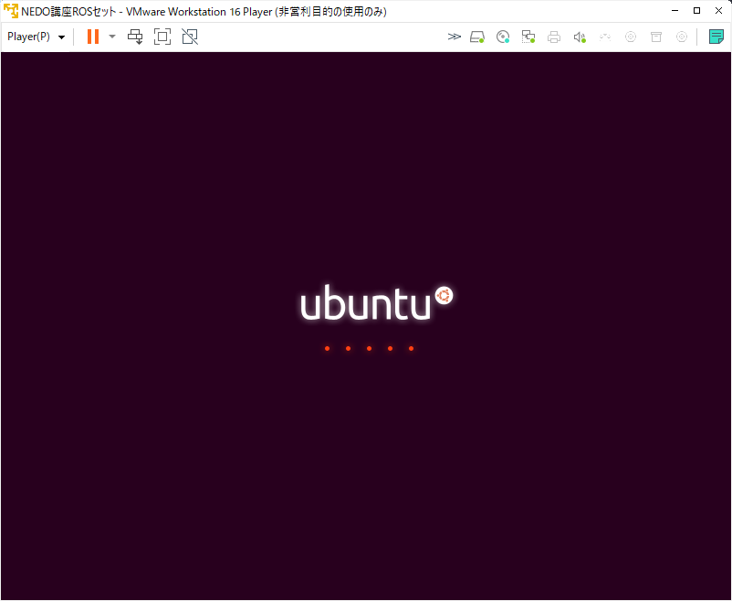

# VMware による NEDO ROSセットの起動

NEDO特別講座で提供している起動可能なROS入りUbuntu LinuxのISOイメージ
(NEDO ROSセットと呼びます) は、DVD-Rなどに書き込んでLive DVD (HDDに
インストールせずに利用する形態のDVD)として利用するものですが、仮想マ
シンを利用することで、WindowsやMac上でUbuntu Linuxを起動することがで
きます。講習会では、TV会議システムを利用しますので、TV会議システムは
Windows上で動作させたまま、仮想マシン上でROS入りUbuntu Linuxを動作さ
せることをお勧めします。

<!-- TOC -->

- [1. VMware Workstation Player](#1-vmware-workstation-player)
    - [1.1. VMware Workstation Player のダウンロード](#11-vmware-workstation-player-%E3%81%AE%E3%83%80%E3%82%A6%E3%83%B3%E3%83%AD%E3%83%BC%E3%83%89)
    - [1.2. VMware Workstation Player のインストール](#12-vmware-workstation-player-%E3%81%AE%E3%82%A4%E3%83%B3%E3%82%B9%E3%83%88%E3%83%BC%E3%83%AB)
- [2. ISOイメージからの起動](#2-iso%E3%82%A4%E3%83%A1%E3%83%BC%E3%82%B8%E3%81%8B%E3%82%89%E3%81%AE%E8%B5%B7%E5%8B%95)
    - [2.1. ISOイメージのダウンロード](#21-iso%E3%82%A4%E3%83%A1%E3%83%BC%E3%82%B8%E3%81%AE%E3%83%80%E3%82%A6%E3%83%B3%E3%83%AD%E3%83%BC%E3%83%89)
    - [2.2. MD5 SUM の確認の仕方](#22-md5-sum-%E3%81%AE%E7%A2%BA%E8%AA%8D%E3%81%AE%E4%BB%95%E6%96%B9)
    - [2.3. VMware 仮想マシンの作成 HDDにインストールしない場合](#23-vmware-%E4%BB%AE%E6%83%B3%E3%83%9E%E3%82%B7%E3%83%B3%E3%81%AE%E4%BD%9C%E6%88%90-hdd%E3%81%AB%E3%82%A4%E3%83%B3%E3%82%B9%E3%83%88%E3%83%BC%E3%83%AB%E3%81%97%E3%81%AA%E3%81%84%E5%A0%B4%E5%90%88)
        - [2.3.1. NEDO ROSイメージの起動](#231-nedo-ros%E3%82%A4%E3%83%A1%E3%83%BC%E3%82%B8%E3%81%AE%E8%B5%B7%E5%8B%95)
    - [2.4. VMware 仮想マシンの作成 HDDにインストールする場合](#24-vmware-%E4%BB%AE%E6%83%B3%E3%83%9E%E3%82%B7%E3%83%B3%E3%81%AE%E4%BD%9C%E6%88%90-hdd%E3%81%AB%E3%82%A4%E3%83%B3%E3%82%B9%E3%83%88%E3%83%BC%E3%83%AB%E3%81%99%E3%82%8B%E5%A0%B4%E5%90%88)
        - [2.4.1. NEDO ROSイメージの起動](#241-nedo-ros%E3%82%A4%E3%83%A1%E3%83%BC%E3%82%B8%E3%81%AE%E8%B5%B7%E5%8B%95)
- [3. その他の仮想マシンプラットフォーム](#3-%E3%81%9D%E3%81%AE%E4%BB%96%E3%81%AE%E4%BB%AE%E6%83%B3%E3%83%9E%E3%82%B7%E3%83%B3%E3%83%97%E3%83%A9%E3%83%83%E3%83%88%E3%83%95%E3%82%A9%E3%83%BC%E3%83%A0)
    - [3.1. VirtualBox](#31-virtualbox)
    - [3.2. Parallels Desktop](#32-parallels-desktop)

<!-- /TOC -->

## 1. VMware Workstation Player

VMware Workstation Player (以下VMware Playerと略します) は、VMware社
から販売されている仮想化ソフトウェアの一つです。VMware Playerは、非
商用利用に限って無償で利用することができます。Windows上でROSがインス
トールされたNEDO ROSセットを起動する方法としては一番おすすめの方法で
す。以下では、VMware PlayerをWindows PCにインストールして、VMware
Player上でNEDO ROSセットを起動する方法を説明します。なお、すでに
VMwareをお持ちの場合は、改めてVMware Playerをダウンロード・インス
トールする必要はありません。有償のVMware Workstationを代わりに利用す
ることができます。

### 1.1. VMware Workstation Player のダウンロード

WMware Workstation Playerは以下のページからダウンロードできます。
Windows用とLinux用があります。

- [VMware Workstation Playerのダウンロード](https://www.vmware.com/jp/products/workstation-player.html)

<div align="center">
<a href="https://www.vmware.com/jp/products/workstation-player.html">

</a>
</div>
<div style="text-align: center;">クリックするとダウンロードページに飛びます</div>

左上の「無償ダウンロード」ボタンを押すと以下のページに飛びます。

<div align="center">
<a href="https://customerconnect.vmware.com/jp/downloads/info/slug/desktop_end_user_computing/vmware_workstation_player/16_0">

</a>
</div>
<div style="text-align: center;">クリックするとダウンロードページに飛びます</div>


ここからVMware Workstation Player をダウンロードしてください。
2023年2月現在のバージョンは 16.2.5 です。


### 1.2. VMware Workstation Player のインストール

Windowsでのインストール方法を説明します。ダウンロードしたインストー
ラを起動すると、以下のような画面が現れてインストールが開始されます。

<div align="center"></div>

特に注意する点はなく、指示通りに進めるとインストールは完了します。

## 2. ISOイメージからの起動

### 2.1. ISOイメージのダウンロード

次に、以下のURLからNEDO ROSイメージのISOイメージをダウンロードします。

<!--
- [ubuntu-18.04.5-nedo_marc-v2-desktop-amd64.iso](https://openrtm.org/pub/NEDO_tutorial/ubuntu-18.04.5-nedo_marc-v2-desktop-amd64.iso)
  - ファイルサイズ: 4.74 GB (5,092,319,232 バイト)
  - MD5 SUM: 383e48206736f81e7142473d564e3bee
-->

- [ubuntu-18.04.6-nedo-desktop-amd64_mycobot.iso](https://openrtm.org/pub/NEDO_tutorial/ubuntu-18.04.6-nedo-desktop-amd64_mycobot.iso)
  - ファイルサイズ: 約5GB (5,000,970,240 バイト)
  - MD5 SUM: 9c6ac7710109c1bfc6bc4bc214ff7b68

ダウンロード後、ファイルサイズが上記と同じになっているか確認してみて
ください。ファイルサイズが同じであればたいていの場合は問題なくダウン
ロードできています。上記のMD5 SUMというのはファイルのハッシュ値で
す。もし、VMwareでうまく起動できない場合は、次の方法でファイルが正し
くダウンロードできているか確認することもできます。

### 2.2. MD5 SUM の確認の仕方

サイズが大きいファイルをダウンロードした場合、ファイルが破損している
場合がまれにあります。もし、うまく起動しない場合は、以下の方法でファ
イルに誤りがないかご確認ください。

Windowsの場合は、エクスプローラーでISOファイルをダウンロードしたフォ
ルダを開きます。エクスプローラのアドレスバーに **cmd** と入力して
Enterを押してください。

<div align="center"></div>

そうすると、そのフォルダの位置でコマンドプロンプトが開きます。次に、
以下のコマンドを入力します。

```
C:\temp>certutil -hashfile ubuntu-18.04.5-nedo_marc-v2-desktop-amd64.iso MD5
```
MD5 SUMを計算するのには数分程度時間がかかります。しばらくすると、
以下のような表示とともに、MD5 SUMが出力されます。

<div align="center">
<a href="figs/md5_cmd.png"></a>
</div>
<div style="text-align: center;">クリックすると拡大します</div>

出力されたMD5 SUMの値が、上記の値と同じか確認してください。MD5 SUMの
値が異なる場合は、ファイルが壊れていますので破棄して再度ダウンロード
してください。


### 2.3. VMware 仮想マシンの作成 (HDDにインストールしない場合)

ダウンロードしたISOイメージは、Live CDになっていますので、HDDにインス
トールせずに使用することもできます。あるいは、HDDにインストールして、恒
久的に使用することもできます。HDDにインストールした方が起動スピードなど
は若干速くなります。

ここでは、HDDにインストールしない場合を説明します。HDDにインストールする
場合は、次の節に飛んでください。

VMware Player を起動します。スタートメニューから VMware Workstation 16
Playerを起動するか、スタートメニュー横の検索窓で vmware などと入力する
と、候補に VMware Workstation 16 Playerが現れますので、クリックして起動
します。

<div align="center"></div>

以下のようなVMwareの画面が出ますので、右側の **「新規仮想マシンの作成(N)」**
をクリックして、新規の仮想マシンを作成します。

<div align="center"></div>

新規仮想マシン作成ウィザードが表示されますので、**あとでOSをインストール** をチェックし次に進みます。

<div align="center"></div>

ゲストOSに **Linux**、バージョンに **Ubuntu 64ビット** が選択されていることを確認して次に進みます。

<div align="center"></div>

**「次に」** ボタンをクリックすると、以下のように仮想ディスクサイズ
を尋ねてきます。今回はLive CDイメージを利用するので、ディスクは使用
しませんが、デフォルトのままにして次に進みます。

<div align="center"></div>

**「次に」** ボタンをクリックすると、以下のように準備完了と表示され
ますが、ここで、ハードウェアを少しカスタマイズしておきます。
**「ハードウェアをカスタマイズ(C)...」** をクリックします。

<div align="center"></div>

すると、以下のように仮想マシンをカスタマイズする画面が表示されます。

<div align="center"></div>

ここで、メモリを可能であれば 4GB 程度に増やしておきます。ホスト側 (今
使っている)PCのメモリに余裕があれば(16GB以上)、8GBに増やしてもよいで
しょう。逆に、ホスト側のメモリに余裕がない(4GBしか装着していないな
ど)場合は、2GBのままにしておいてください。ただ、この場合、VMwareの動
作が遅くなる可能性がありますので、できるだけスペックに余裕のあるPCを
使った方がよいでしょう。

#### 2.3.1. NEDO ROSイメージの起動

設定を保存し、新規仮想マシン作成ウィザードの完了ボタンを押すと、準備
完了です。以下のような画面になっているはずです。

<div align="center"></div>

仮想マシンの起動を押すと、仮想マシンが起動します。順に以下のような画
面が表示されます。起動には多少時間がかかりますので待ちます。途中
Vmware Toolsのインストールを促されますが、無視してください。(「通
知しない」ボタンをクリック)

<div align="center"></div>

<div align="center"></div>

<div align="center"></div>

最終的に以下のような画面が表示されます。
左側のリストの下の方に **「日本語」** がありますので、
選択し、**「Ubuntuを試す」** をクリックしてください。

<div align="center"></div>

その後、**Ubuntuへようこそ** という画面が表示されますので、
上部メニューの **Ubuntuへようこそ** から **終了** を選択します。

<div align="center"></div>

以下のUbuntu のデスクトップ画面が表示されたら準備完了です。

<div align="center"></div>

### 2.4. VMware 仮想マシンの作成 (HDDにインストールする場合)

VMware Player を起動します。スタートメニューから VMware Workstation 16
Playerを起動するか、スタートメニュー横の検索窓で vmware などと入力する
と、候補に VMware Workstation 16 Playerが現れますので、クリックして起動
します。

<div align="center"></div>

以下のようなVMwareの画面が出ますので、右側の **「新規仮想マシンの作成(N)」**
をクリックして、新規の仮想マシンを作成します。

<div align="center"></div>

- **インストーラディスクイメージファイル(M)(iso):** をクリックし
- **「参照(R)」** ボタンをクリックし、先ほどダウンロードした iso イメージファイルを選択

します。すると以下のような画面になります。

<div align="center"></div>

- フルネーム: tork
- ユーザー名: tork
- パスワード: password
- 確認: password

と入力して次に進みます。

<div align="center"></div>

**「次に」** ボタンをクリックし、仮想マシン名を付けます。マシン名は
何でも結構ですが、ここでは、 **"NEDO講座ROSイメージ"**という名前にして
おきます。

<div align="center"></div>

**「次に」** ボタンをクリックすると、以下のように仮想ディスクサイズ
を尋ねてきます。今回はLive CDイメージを利用するので、ディスクは使用
しませんが、デフォルトのままにして次に進みます。

<div align="center"></div>

**「次に」** ボタンをクリックすると、以下のように準備完了と表示され
ますが、ここで、ハードウェアを少しカスタマイズしておきます。
**「ハードウェアをカスタマイズ(C)...」** をクリックします。

<div align="center"></div>

すると、以下のように仮想マシンをカスタマイズする画面が表示されます。

<div align="center"></div>

ここで、メモリを可能であれば 4GB 程度に増やしておきます。ホスト側 (今
使っている)PCのメモリに余裕があれば(16GB以上)、8GBに増やしてもよいで
しょう。逆に、ホスト側のメモリに余裕がない(4GBしか装着していないな
ど)場合は、2GBのままにしておいてください。ただ、この場合、VMwareの動
作が遅くなる可能性がありますので、できるだけスペックに余裕のあるPCを
使った方がよいでしょう。

次に進むと、以下のようなインストール画面が表示されインストールが開始されます。

<div align="center"></div>

インストールにはしばらく時間がかかります。インストール終了後は、再起動してOSが起動することを確認してください。

#### 2.4.1. NEDO ROSイメージの起動

仮想マシンの起動を押すと、仮想マシンが起動します。順に以下のような画
面が表示されます。起動には多少時間がかかりますので待ちます。途中
Vmware Toolsのインストールを促されますが、無視してください。(「通
知しない」ボタンをクリック)

<div align="center"></div>

<div align="center"></div>

最終的に以下のような画面が表示されます。

<div align="center"></div>

以下のUbuntu のデスクトップ画面が表示されたら準備完了です。（メニューは英語かもしれません。）

<div align="center"></div>

## 3. その他の仮想マシンプラットフォーム

VMware の代わりに利用できる仮想マシンプラットフォームを紹介します。
これらの仮想マシンプラットフォームを利用してもISOイメージを起動して
講習会にて利用することができます。

利用の仕方は上述のVMwareとほぼ同じで、

1. 仮想マシンプラットフォームダウンロード
2. 仮想マシンプラットフォームインストール
3. ISOイメージダウンロード
4. 仮想マシンを新規に1つ作成
5. 仮想マシンのCDドライブにISOファイルを割り当て
6. 起動して利用

という手順となりますので、適宜それぞれの環境で読み替えて行ってみてください。

### 3.1. VirtualBox

VirtalBoxはOracleが無償で公開している仮想マシンプラットフォームです。
Windowsだけでなく、MacOS、Linuxの様々なディストリビューション等、
多くの環境で動作させることができます。

- [VirtualBoxダウンロード](https://www.oracle.com/jp/virtualization/technologies/vm/downloads/virtualbox-downloads.html)

VirtualBoxはMacOS上でも動作しますが、こちらで試した結果、ISOイメージ
を起動してもかなり動作が重く、操作に支障があるレベルでした。マシンス
ペックによってはスムーズに動作する可能性がありますが、その場合は、次
のParallels Desktopの14日間のトライアル版を利用することをお勧めしま
す。

### 3.2. Parallels Desktop

Parallels Desktopは Parallels社が販売しているMacOS専用の仮想マシンプ
ラットフォームです。Parallelsには14日間の無償トライアルプログラムが
用意されているので、講習会のために一次的に利用することができます。

- [Parallelsダウンロード](https://www.parallels.com/jp/products/desktop/trial/)

なお、Apple M1チップを搭載したMacBook Pro, MacBook Air, Mac miniでは
動作しませんのでご注意ください。
